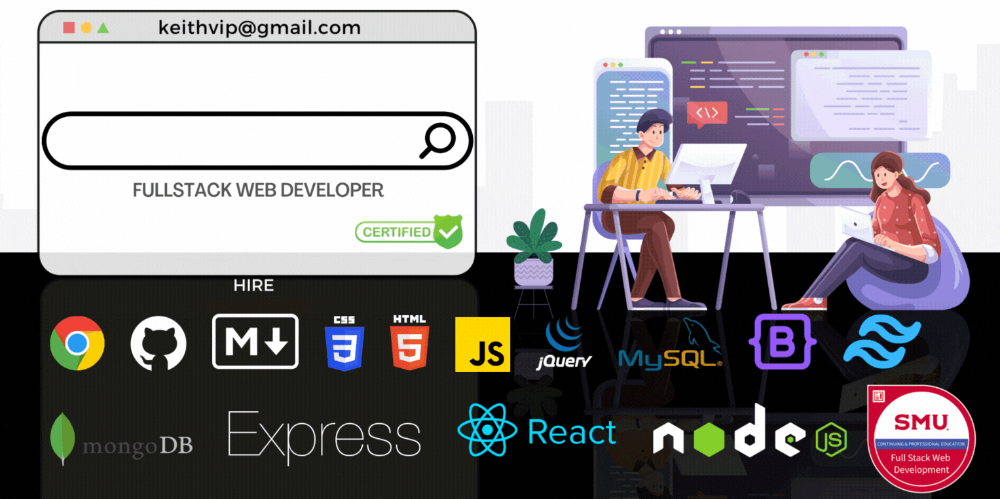

# About
Hi, I'm Keith.

<!-- I'm a cybernatic warrior 🤖 on my spare time, and a professional web developer by day. -->

# Education
> **Bachelor of Arts**  
> *Philosophy*  
> Texas Wesleyan University  
> Ft. Worth, Texas  
> December 2004

> [**Certification**](https://www.credly.com/earner/earned/badge/37a5c1e8-7031-4e9b-a627-1a9f51067a12)  
> *Fullstack Web Development*  
> Southern Methodist University  
> Dallas, Texas  
> August 2022
> > **Relevant Courses**
> > - Web APIs
> > - Third-Party APIs
> > - Server-Side APIs
> > - Node
> > - Object-Oriented Programming
> > - Express
> > - SQL
> > - Model-View-Controller
> > - Computer Science
> > - NoSQL
> > - Progressive Web Application
> > - React
> > - MERN
> > - State

# Resume
