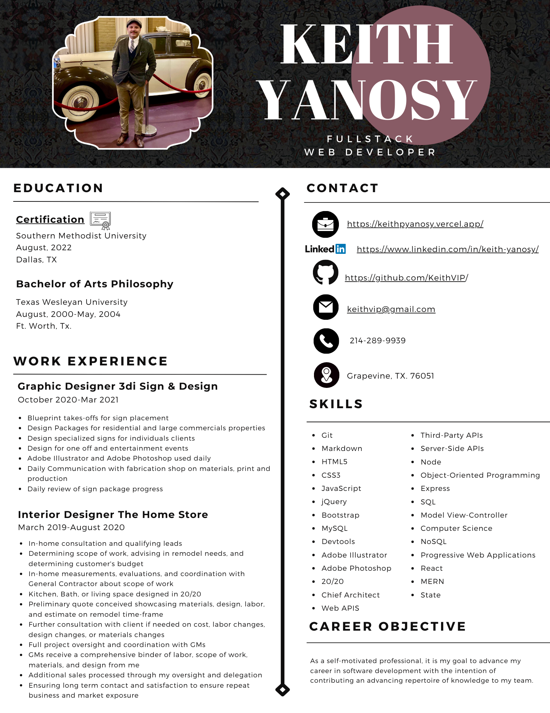

<h1 style='font-weight: bold; font-size: 3rem;' align='center'>
Welcome
</h1>

If you are an employer, recruiter, or developer looking to work together, follow the links below!

> [LinkedIn](https://www.linkedin.com/in/keith-yanosy)  
> [Portfolio](https://keithpyanosy.vercel.app//)  
> [Resume](https://drive.google.com/file/d/1BRclPQ5q0Y-SMY3bEt1ana2lWFY-pyZV/view?usp=sharing) 

<h1 style='font-weight: bold; font-size: 3rem;' align='center''>
About
</h1>

I'm a Full Stack Developer that recently made the transtion from the Interior Design and Home Remodel Industry.

<h1 style='font-weight: bold; font-size: 3rem;' align='center''>
Education
</h1>

> **Bachelor of Arts**  
> *Philosophy*  
> Texas Wesleyan University  
> Ft. Worth, Texas  
> December 2004

> [**Certification**](https://www.credly.com/badges/37a5c1e8-7031-4e9b-a627-1a9f51067a12/public_url)  
> *Fullstack Web Development*  
> Southern Methodist University  
> Dallas, Texas  
> August 2022
> > **Relevant Courses**
> > - Web APIs
> > - Third-Party APIs
> > - Server-Side APIs
> > - Node
> > - Object-Oriented Programming
> > - Express
> > - SQL
> > - Model-View-Controller
> > - Computer Science
> > - NoSQL
> > - Progressive Web Application
> > - React
> > - MERN
> > - State

<!-- <h1 style='text-align: center;'>
Resume
</h1>

 -->